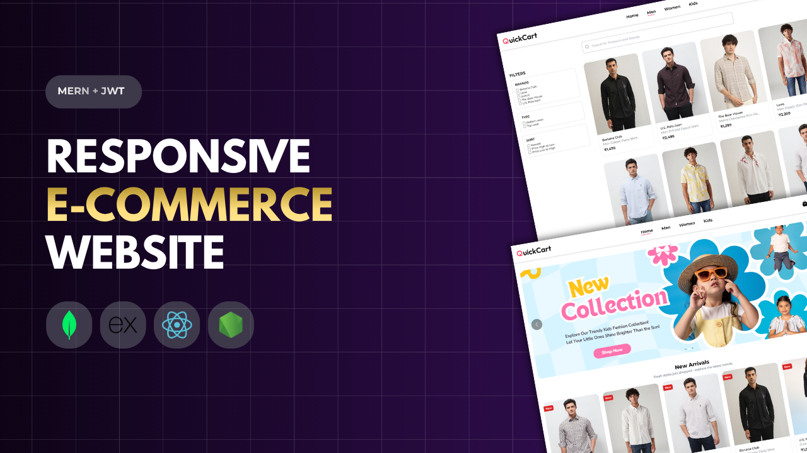
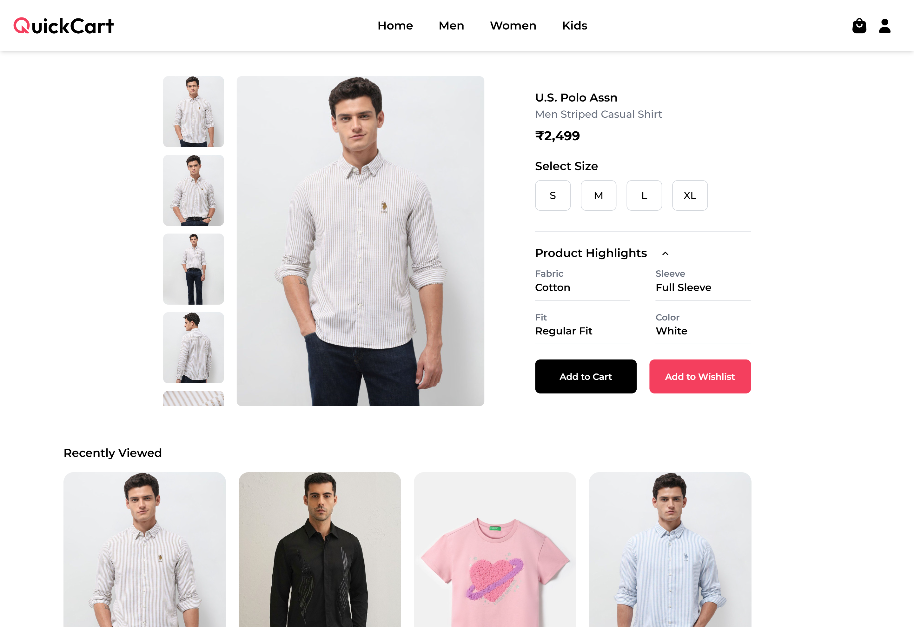
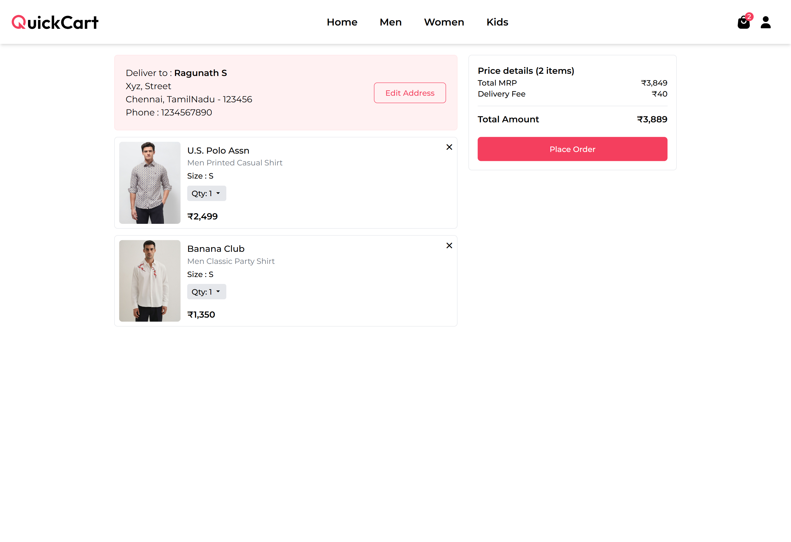
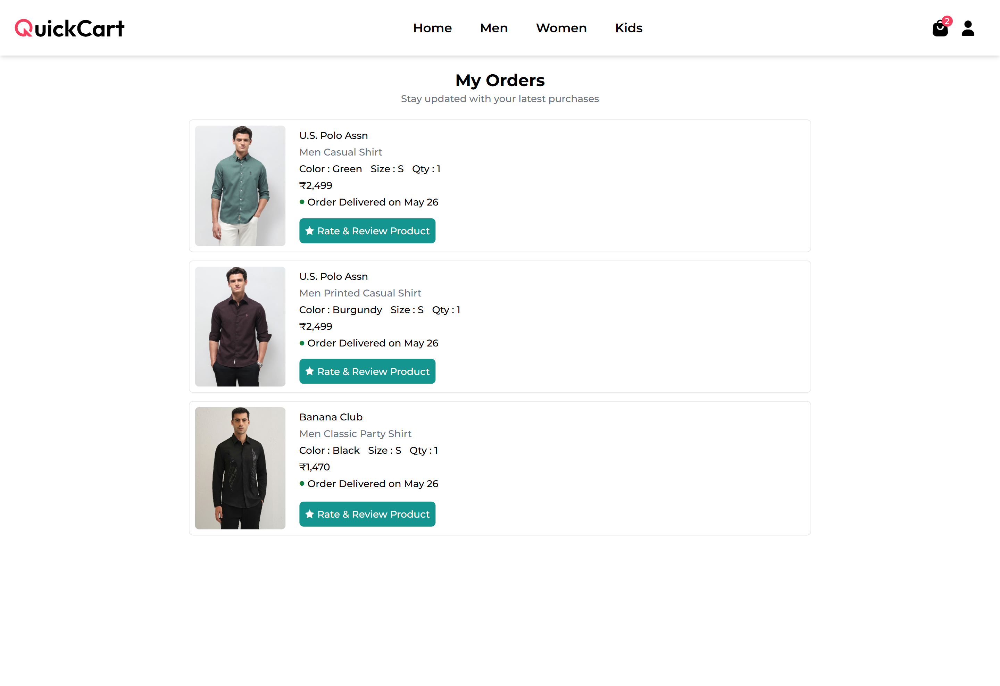
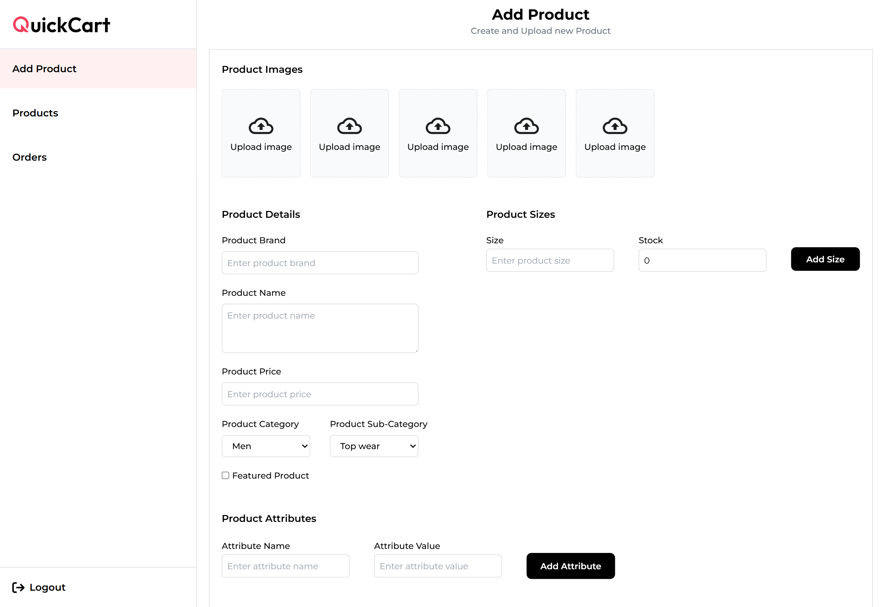

# QuickCart – Clothing E-Commerce Platform

QuickCart is a full-stack e-commerce web application built using the MERN stack.

It enables users to browse products, manage wishlists and carts, securely place orders, make online payments, track deliveries, and submit verified product reviews through a seamless shopping experience.

---

## Live Demo

https://quickcart-online.vercel.app

---

## Thumbnail

---

## Preview

<table>
  <tr>
    <td> <b>1. Home Page</b>  </td>
    <td> <b>2. Product Detail Page</b>  </td>
  </tr>
  <tr>
    <td> <b>3. Cart Page</b>  </td>
    <td> <b>4. My Orders Page</b>  </td>
  </tr>
  <tr>
    <td> <b>5. Admin Dashboard</b>  </td>
    <td></td>
  </tr>
</table>

---

## Key Highlights

### 1. Seamless Product Discovery

Users can explore products through a clean and through a clean and easy-to-use interface with detailed product information, images, pricing, ratings, and descriptions.

---

### 2. Personalized Shopping Experience

The platform includes wishlist management and recently viewed products, allowing users to revisit products and continue their shopping journey effortlessly.

---

### 3. Efficient Cart Management

Users can add products to their cart, update quantities, remove items, and review their selections before proceeding to checkout.

---

### 4. Secure Authentication System

The application uses JWT-based authentication with secure cookie handling to protect user accounts and ensure secure access to protected resources.

---

### 5. Smooth Order Placement Workflow

Customers can manage delivery addresses, place orders, track order status, and access their complete order history through a dedicated dashboard.

---

### 6. Verified Product Reviews & Ratings

Only customers with successfully delivered orders can submit reviews and ratings, ensuring authentic feedback and improving product credibility.

---

### 7. Admin Inventory & Order Management

Administrators can manage products, monitor inventory, update order statuses, and oversee the complete order lifecycle through an admin dashboard.

---

### 8. Secure Online Payments

Razorpay integration enables secure payment processing and provides a smooth checkout experience for customers.

---

### 9. Fully Responsive Design

The application is optimized for mobile, tablet, and desktop devices, delivering a consistent user experience across all screen sizes.

---

## Features

### Authentication & Authorization

- JWT-based login and registration
- Secure cookie-based authentication
- Protected routes for users and administrators

### Product Browsing

- Browse products by category
- Detailed product information pages
- Recently viewed products
- Product ratings and reviews

### Cart & Wishlist

- Add and remove products from cart
- Wishlist management
- Quantity updates
- Persistent shopping experience

### Order Management

- Address management
- Order placement and tracking
- Order history for users

### Verified Reviews

- Review system for delivered orders only
- Product ratings (1–5 stars)
- Customer feedback management

### Admin Dashboard

- Product management
- Inventory management
- Order status updates
- Product editing and deletion

### Payments

- Razorpay payment gateway integration
- Secure checkout process

### Notifications

- Real-time user feedback using React Toastify

### Responsive UI

- Mobile-first responsive design
- Optimized layouts for all screen sizes

---

## Tech Stack

### Frontend

- React.js
- React Router
- Tailwind CSS
- Axios
- React Toastify

### Backend

- Node.js
- Express.js
- MongoDB (Mongoose)
- JWT Authentication

### Other Tools

- Razorpay Payment Gateway
- Cloudinary
- Dotenv
- Cookie-parser
- CORS

---

## Future Improvements

- Product recommendation system
- Coupon and discount management
- Email notifications for order updates
- Advanced analytics dashboard
- Social authentication (Google & Apple OAuth)
- Product search with advanced filters
- Inventory insights and reporting

---

## Author

**Ragunath S**

GitHub: https://github.com/Ragunath-1014

---

⭐ If you like this project, please consider giving it a star on GitHub!